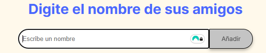
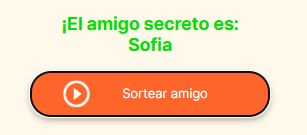

# 🎁 Amigo Secreto Digital
> Proyecto desarrollado para [Oracle ONE](enlace-oficial)
## ▶️ Demo Interactiva

**Video tutorial completo (1 minuto):**  
🔗 [Ver demostración en Streamable](https://streamable.com/7lxzgl) *(Haz clic para ver el funcionamiento real)*

---

## 🛠️ Cómo usar

1. **Abrir la aplicación**:  
   - Ejecuta `index.html` en cualquier navegador moderno
     
2. **Agregar participantes**:
   - Escribe cada nombre en el campo
   - Presiona <kbd>Enter</kbd> o haz clic en "Añadir"

3. **Realizar sorteo**:  
   - Haz clic en "Sortear amigo" cuando la lista esté completa

---

## 📹 Extracto del video

| Paso clave | Captura |
|-----------|---------|
| Agregar nombres |  |
| Resultado |  |

---

## 🧰 Tecnologías utilizadas
- 
- 
- 
